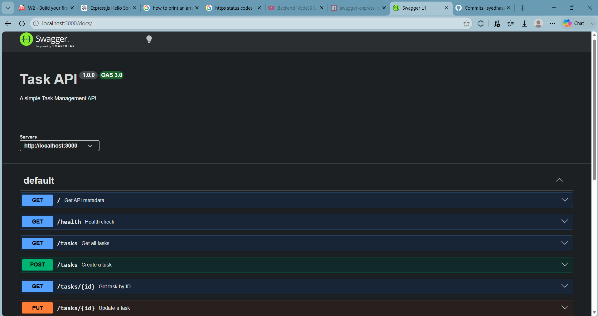

# Task API

Simple Express task management API with in-memory storage and OpenAPI docs.

## Prerequisites

- Node.js 18+ (or newer)
- npm

## Setup

```bash
npm install
```

## Run

Development mode (uses nodemon via npm script):

```bash
npm start
```

App base URL:

- http://localhost:3000

API docs (Swagger UI):

- http://localhost:3000/docs

## Endpoint Table

| Method | Path        | Description                                   | Success Status | Error Status                   |
|--------|-------------|-----------------------------------------------|----------------|--------------------------------|
| GET    | `/`         | API metadata (`name`, `version`, `endpoints`) | `200`          | -                              |
| GET    | `/health`   | Health check                                  | `200`          | -                              |
| GET    | `/tasks`    | Get all tasks                                 | `200`          | -                              |
| GET    | `/tasks/:id`| Get a task by id                              | `200`          | `404` if not found             |
| POST   | `/tasks`    | Create a new task                             | `201`          | `400` if `title` missing/empty |
| PUT    | `/tasks/:id`| Update task `title` and/or `done`             | `200`          | `404` if not found             |
| DELETE | `/tasks/:id`| Delete a task by id                           | `204`          | `404` if not found             |

## Example API Request

```bash
curl -i -X POST http://localhost:3000/tasks -H "Content-Type: application/json" -d "{\"title\":\"Buy milk\"}"
HTTP/1.1 201 Created
X-Powered-By: Express
Content-Type: application/json; charset=utf-8
Content-Length: 40
ETag: W/"28-PpSBYV7i68cXyGc7AhjVpkZkY5Q"
Date: Mon, 27 Jul 2026 15:47:43 GMT
Connection: keep-alive
Keep-Alive: timeout=5

{"id":4,"title":"Buy milk","done":false}
```


## Swagger Documentation

Swagger UI is available at:

http://localhost:3000/docs

Screenshot:



## Notes

- Data is stored in memory. Restarting the server resets tasks.
- Current `PUT /tasks/:id` response returns the full tasks array.
